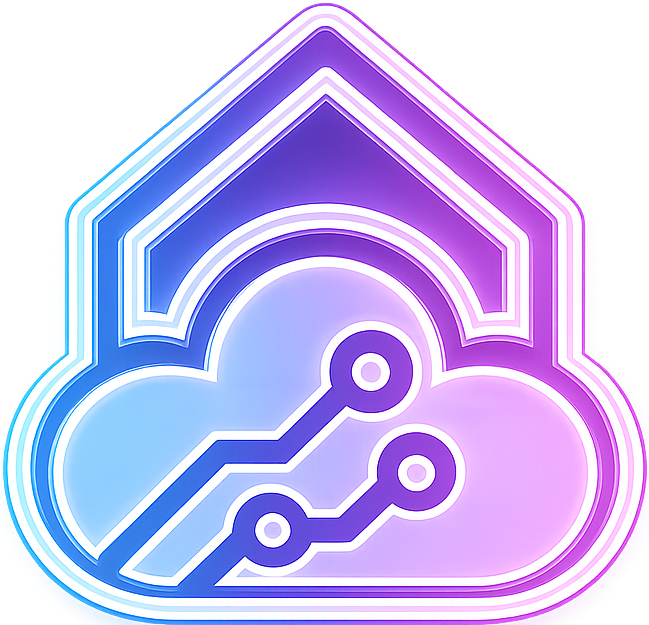

<div align="center">

<!-- Profile Card -->


### Full-Stack Web Developer

[](https://git.io/typing-svg)

<br>

<!-- Social -->
<a href="https://codepen.io/VideoGameRoulette" title="CodePen"></a>
<a href="https://www.twitter.com/VGRoulette/" title="Twitter"></a>
<a href="https://www.twitch.tv/videogameroulette/" title="Twitch"></a>
<a href="mailto:contact@inhousecloudsolutions.com" title="Email"></a>

</div>

---

## Focus Areas

```text
  Frontend     React · Next.js · TypeScript · Tailwind · MUI
  Backend      Django · DRF · GraphQL · PostgreSQL · Redis
  Data         SQLite (dev & non-critical assets) · PostgreSQL (production)
  Tooling      Docker · Git · Playwright · AI-assisted development
```

## Currently Learning

| Area | Focus |
| :--- | :--- |
| **Quality** | End-to-end testing with Playwright |
| **Workflow** | AI-assisted development with Cursor & modern tooling |

---

## Featured Projects

<table>
  <tr>
    <td width="170" align="center" valign="middle">
      <a href="https://www.inhousecloudsolutions.com/"></a>
    </td>
    <td valign="middle">
      <a href="https://www.inhousecloudsolutions.com/"><b>In House Cloud Solutions</b></a><br>
      <sub>In-house feel, cloud-powered backbone — custom websites and internal tools</sub>
    </td>
  </tr>
  <tr>
    <td align="center" valign="middle">
      <a href="https://noreset.tv/"></a>
    </td>
    <td valign="middle">
      <a href="https://noreset.tv/"><b>NoReset</b></a><br>
      <sub>Charity-based speedrunning marathon organization platform</sub>
    </td>
  </tr>
  <tr>
    <td align="center" valign="middle">
      <a href="https://cortinakitchens.com"><span style="display:inline-block;background-color:#ffffff;padding:6px 10px;border-radius:6px;line-height:0"></span></a>
    </td>
    <td valign="middle">
      <a href="https://cortinakitchens.com"><b>Cortina Kitchens Inc.</b></a><br>
      <sub>Kitchen company creating a Lifestyle Built with care</sub>
    </td>
  </tr>
  <tr>
    <td align="center" valign="middle">
      <a href="https://niico.com"><span style="display:inline-block;background-color:#ffffff;padding:6px 10px;border-radius:6px;line-height:0"></span></a>
    </td>
    <td valign="middle">
      <a href="https://niico.com"><b>NIICO Millwork</b></a><br>
      <sub>Luxury cabinetry · interiors · design</sub>
    </td>
  </tr>
</table>

---

## Recent Games Worked On

<div align="center">
  <a href="https://store.steampowered.com/app/332200/Axiom_Verge/"></a>
  &nbsp;&nbsp;
  <a href="https://www.epicgames.com/store/en-US/p/axiom-verge-2"></a>
  &nbsp;&nbsp;
  <a href="https://store.steampowered.com/app/1035560/Struggling/"></a>
</div>

---

<details>
<summary><b>Operating Systems</b></summary>
<br>
<div align="center">
  &nbsp;
  &nbsp;
  
</div>
</details>

<details>
<summary><b>Desktop — Languages & Frameworks</b></summary>
<br>
<div align="center">
  &nbsp;
  &nbsp;
  
</div>
</details>

<details>
<summary><b>Web — Languages</b></summary>
<br>
<div align="center">
  &nbsp;
  &nbsp;
  &nbsp;
  &nbsp;
  &nbsp;
  
</div>
</details>

<details>
<summary><b>Web — Frameworks & Libraries</b></summary>
<br>
<div align="center">
  &nbsp;
  &nbsp;
  &nbsp;
  &nbsp;
  
  <br><br>
  &nbsp;
  &nbsp;
  &nbsp;
  &nbsp;
  &nbsp;
  
</div>
</details>

<details>
<summary><b>Databases & Caching</b></summary>
<br>
<div align="center">
  &nbsp;
  &nbsp;
  &nbsp;
  &nbsp;
  &nbsp;
  
</div>
</details>

<details>
<summary><b>DevOps, Cloud & Middleware</b></summary>
<br>
<div align="center">
  &nbsp;
  &nbsp;
  &nbsp;
  &nbsp;
  
  <br><br>
  
</div>
</details>

<details>
<summary><b>Tools, Testing & Workflow</b></summary>
<br>
<div align="center">
  &nbsp;
  &nbsp;
  &nbsp;
  &nbsp;
  &nbsp;
  &nbsp;
  &nbsp;
  
  <br><br>
  &nbsp;
  &nbsp;
  &nbsp;
  &nbsp;
  &nbsp;
  &nbsp;
  &nbsp;
  
</div>
</details>

---

## GitHub Activity

<div align="center">

[](https://git.io/streak-stats)

<br>

[](https://github.com/ashutosh1910/github-readme-activity-graph)

</div>

<div align="center">
  <br>
  
</div>
